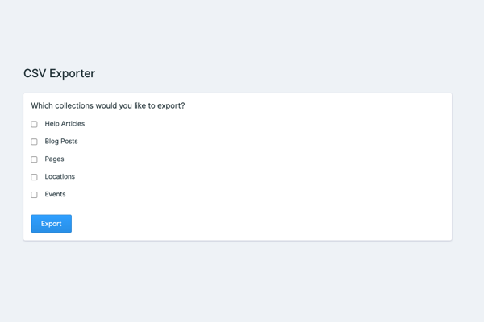

<!-- statamic:hide -->



# Statamic CSV Exporter

<!-- /statamic:hide -->

This addon gives you the ability to export your content to CSV files.

## Installation

You can search for this addon in the `Tools > Addons` section of the Statamic Control Panel and click **install**, or run the following command from your project root:

```bash
composer require steadfastcollective/statamic-csv-exporter
```

## Usage

To use this addon, follow the usage instructions or [watch this video](https://www.loom.com/share/2d4f2777408a47b1b53d283a0db2cba4):

1. Head into the Control Panel
2. Go to `Utilities` and click into the 'CSV Exporter' utility
3. Select the collections you wish to export and click the 'Export' button
4. A ZIP file will be downloaded. If you open that, you'll find each collection in its own CSV file.

### Ignoring certain fields

If you'd like to exclude certain fields from being returned by the export, you should add them to the addon's configuration file

By default, you're unlikley to have the configuration file published. To publish it, run:

```
php artisan vendor:publish --tag=statamic-csv-exporter-config
```

The config file will appear as `config/statamic-csv-exporter.php`.

In the config file, you will see an `ignored_fields` array. Inside that, add the handle of the collection, then any of the fields you wish to be excluded.

In the below example: exports for the `events` collection will exclude the `author` and `excerpt` fields.

```php
/*
|--------------------------------------------------------------------------
| Ignored fields
|--------------------------------------------------------------------------
|
| Configure any fields which should be ignored when exporting items.
|
*/

'ignored_fields' => [
    'collections' => [

        'events' => [
            'author', 'excerpt',
        ],

    ],
],
```

## Changelog

Please see [CHANGELOG](https://github.com/steadfast-collective/statamic-csv-exporter/blob/main/CHANGELOG.md) for more information what has changed recently.

## Security

If you discover any security related issues, please email [dev@steadfastcollective.com](mailto:dev@steadfastcollective.com) instead of using the issue tracker.

## License

The MIT License (MIT). Please see [License File](https://github.com/steadfast-collective/statamic-csv-exporter/blob/main/LICENSE.md) for more information.
